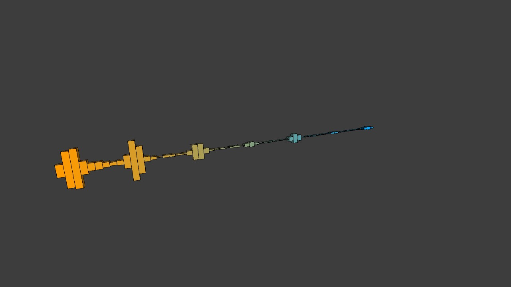
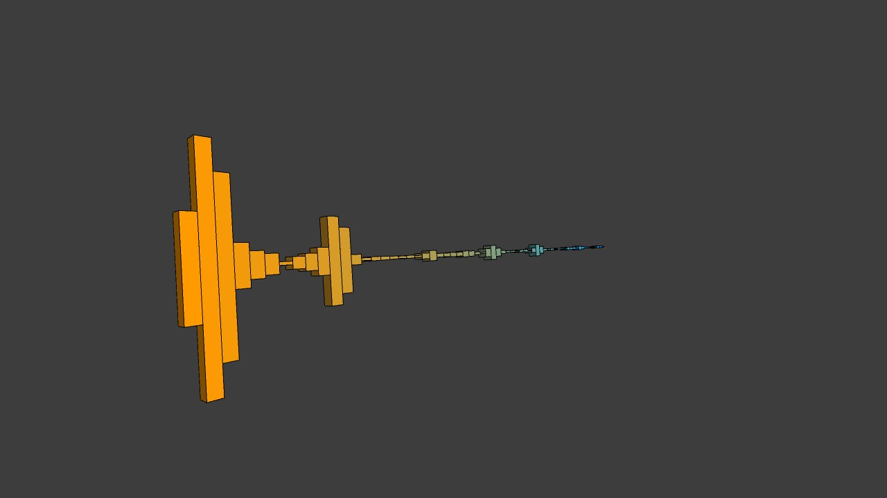
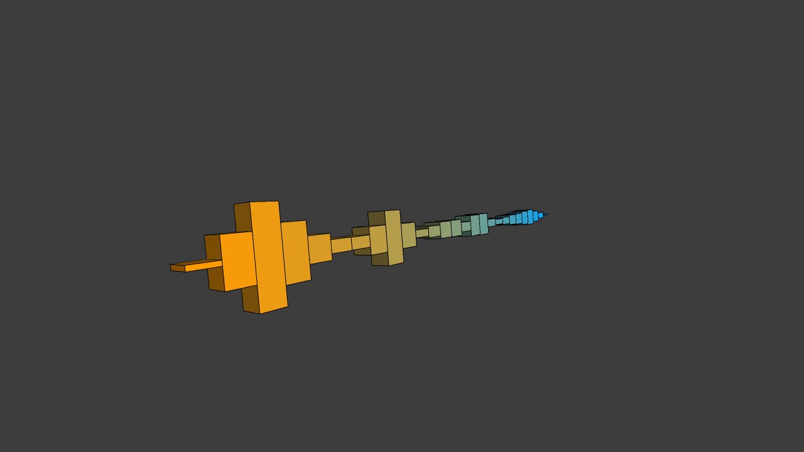

# Tajrian Rahman TuesdayW03:
I tried to make an audio visualizer with 3d shapes. Not really anything too complicated today, but that's because I didn't have as much time to work.

## References:
* [selectInput](https://processing.org/reference/selectInput_.html)
* [FFT](https://processing.org/reference/libraries/sound/FFT.html)
* [lerpColor()](https://processing.org/reference/lerpColor_.html)

## Controls:
* 'Spacebar': Play/Pause music
* '=' or '+': Increase number of bars
* '-': Decrease number of bars
* 's': Save a screenshot
* Double-click: Reset camera (PeasyCam)

## Media:
<video controls src="mov/Tajrian_Rahman_TuesdayW03.mp4" title="How to use:"></video>